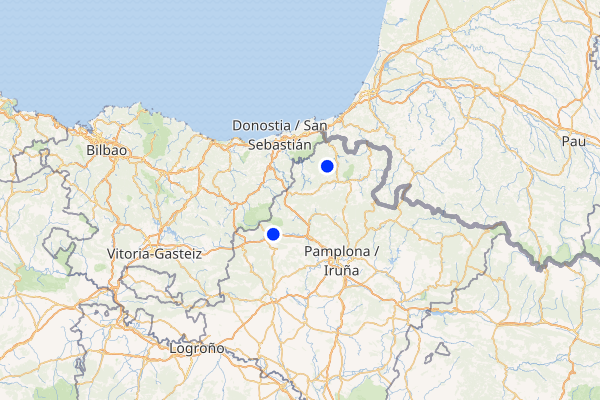

# Egunean behin distantziak (eta iraupenak)

## Nola erabili

### 1. Ingurune birtuala sortu

```bash
$ python3 -m venv myenv
```

### 2. Ingurune birtuala aktibatu

```bash
$ source myenv/bin/activate
```

### 3. Dependentziak instalatu

```bash
$ pip3 install -r requirements.txt
```

### 4. Programaren exekuzioa

```bash
$ python3 distantziak.py $d
```
Non $d, sortu nahi diren galdera kopurua den (osokoa).

## Galderen izaera
Bi galdera mota sortzen dira: distantziei buruzkoak eta iraupenei buruzkoak.

Bietarako 600x400 pixeletako mapa bat sortuko da, non bi puntu markatzen diren.

Jokalariak asmatu beharko du zein distantzia/iraupen dagoen markatutako bi puntuen artean, kotxez bide laburrena eginez. Distantziaren kasuan unitatea kilometroa izango da, eta iraupenarenean orduak eta minutuak.

## Distantziak eta iraupenak sortzeko programa

### 1. Wikidata zerbitzaritik informazioa lortu
Zerbitzaritik `query.rq` fitxategian dagoen kontsulta lortzeko `SPARQLWrapper` liburutegia erabiltzen da. Liburutegi honen bitartez fitxategitik kargatutako kontsultaren emaitza eskuratuko da, eta JSON motako erantzuna aldagai batean gorde. Erantzunaren adibide gisa utzi da `data.json` fitxategia, non `results["bindings"]` erroan, Euskal Herriko herri, hiri zein udaletxe bakoitzeko sarrera bat dagoen. Erantzuneko `bindings` erroa izen bereko aldagaiean gordeko da, eta honi esker kontsulta programaren exekuzio bakoitzeko behin soilik egikarituko da.

### 2. n galdera sortu
Behin `bindings` aldagaian beharrezko hiri eta herri guztiak ditugula, eskatutako galdera kopurua sortuko da. Prozesu osoan zehar kontsolan bilakaera-barra edo "progress bar" bat agertuko zaigu, adieraziz orain arte zenbat galdera sortu diren modu grafiko batean. Iterazio bakoitzean ausazko bi kokaleku desberdin lortuko dira, eta hauen izen, latitude eta longitudea eskuratuko dira. Behin hauek eskuratuta, hauen arteko kotxezko distantzia eta iraupena lortuko dira, eta mapa-irudi bat sortu, bi puntu horiek borobil urdin batez markatuta dituena.  

#### 2.1 Distantzia eta iraupen zuzenak eskuratu
Distantzia eta iraupena lortzeko [OSRM](http://project-osrm.org/docs/v5.22.0/api) web-zerbitzua erabili da. API honek eskaintzen dituen aukeretatik "route service" zerbitzua erabili da. Honi GET eskaera bidez bi kokaleku pasako dizkiogu, eta JSON objektu bat sortuko digu, bi kokaleku hauen arteko bide laburrenaren iraupen eta distantziak barne izango dituena. Zerbitzuari GET eskaera egiteko `requests` liburutegia erabili da. Ausaz sortutako kokalekuen formatua aldatu beharko da, zerbitzuak eskatzen duenera egokitu dadin. Behin URLa sortuta, zerbitzariari GET eskaera egingo zaio. Zerbitzariak erantzuten duenean erantzun zuzena izango direnn distantzia eta iraupena izango ditugu.

#### 2.2 Distantzia eta iraupen okerrak eskuratu
Distantzia eta iraupen okerrak sortzeko funtzio berdina erabiltzen da. Erantzun okerra gerta daiteke hiru motakoa izatea: erantzun zuzena baino txikiagoak izatea biak, erantzun zuzena baino handiagoa izatea biak, eta erantzun zuzena baino handiagoa izatea bat, eta txikiagoa bestea. Kasu horiek tratatzeko 0 eta 2 arteko ausazko osoko bat sortuko da, eta horren arabera erantzun okerrak sortuko dira. Erantzun okerrak erantzun zuzenarekiko proportzionalak izango dira. Hau da, `min_proportion` eta `max_proportion` arteko ausazko zenbaki bat sortuko da, eta hori proportzionalki (erantzun zuzenarekin biderkatuz) gehitu edo kenduko zaio erantzun zuzenari, erantzun okerra sortzeko.   
Galderen zailtasun-maila handitu (edo txikitu) nahiko balitz, `min_proportion`, `max_proportion` eta `step` aldagaiak aldatu beharko lirateke. Hau da, zailtasuna handitu nahiko balitz, aldagai hauen balioa txikitu, erantzun zuzen eta okerren arteko tartea txikiagoa izateko. Kontrakoa, ordea, zailtasuna txikitzeko.

#### 2.3 Erantzunaren esteka eskuratu
Jokalariak partida amaitzen duenean, jakin nahiko du erantzun zuzena zein den, eta era grafiko batean erakusten baldin bazaio askoz ere erakargarriagoa izango da. Horretarako, galdera bakoitzerako openstreemap.org orrialderako esteka bat sortuko da, non galderako bi puntuen arteko bidea markatuta azaltzen den, hau autoz egiteko behar den iraupen eta kilometroekin batera (distantzia). Galderaren erantzun zuzena OSRM apiaren bitartez sortu da, eta erabiltzaileari erakusteko esteka, ordea, OpenStreetMap zerbitzua erabiliz. Azken honek, ordea, OSRM APIa erabiltzen du bi punturen arteko bidea aurkitzeko. Hortaz, bietatik lortutako erantzuna berdina izango da.


#### 2.4 Mapa sortu
Sortutako bi puntu bakoitzeko mapa bat sortzen da. Hau da, iraupen eta distantzia bakoitzagatik mapa bat sortuko da, eta bide batetik (bi puntu) lortutako bi galderek mapa berdina izango dute erreferentzia bezala.  
Mapa sortzeko `staticmap` liburutegia erabiliko da. Liburutegi honen bitartez 600x400 pixeleko irudi bat sortuko da, non galderako bi kokalekuak puntu urdin batez markatuta azalduko diren. Hau lortzeko, [tile server](https://wiki.openstreetmap.org/wiki/Tile_servers) bat pasa beharko diogu liburutegiari. Gure gustuen arabera zerbitzari bat edo bestea aukera genezake, kodean defektuz [maps.wikimedia.org](maps.wikimedia.org)rena utzi da (hala ere, bi alternatiba utzi dire kodean komentatuta). 


#### 2.5 Erantzuna fitxategi(et)an idatzi
Azkenik, sortutako datuak csv formatuko fitxategietan gordeko dira. Fitxategi hauen izenak programaren hasieran daude definituta: `distances_file` eta `durations_file`. Programak galdera, erantzunak, eta esteka eskatutako formatuan gordeko ditu csv fitxategietan. Distantzien galderak eta erantzunak defektuz `distances.csv` fitxategian gordeko dira, eta iraupenenak `durations.csv` fitxategian. Fitxategi bakoitzaren lehen lerro bezala `Mota;Galdera;Irudia;Zuzena;Oker1;Oker2;Jatorria;Esteka;Egilea;` goiburua azalduko da, adieraziz zein den gainontzeko lerroen formatua.


## Exekuzio adibidea
Aplikazioa martxan ikusteko, programari bost galdera sortzeko esango diogu:
  
Exekuzioarekin lortutako fitxategiak `distances.csv` `durations.csv` eta `./maps` karpetako `.png` irudiak dira.  
Har dezagun emaitzen arteko galdera bat:  

### Emaitza

#### kokalekuak
Karkamu(Araba) eta Cascante(Nafarroa)

#### Mapa(irudia):
75be8e2db44a4cd682b719f99b725ba4.png


#### `distances.csv` fitxategia
+ **galdera**: Zer distantzia dago kotxez Lakuntza eta Arantzaren artean?
+ **erantzun zuzena**: 100km
+ **erantzun okerra 1**: 119km
+ **erantzun okerra 2**: 126km


#### `durations.csv` fitxategia
+ **galdera**: Zenbat denbora behar da Lakuntzatik Arantzara kotxez joateko?
+ **erantzun zuzena**: 1 ordu eta 18 minutu
+ **erantzun okerra 1**: 1 ordu eta 8 minutu
+ **erantzun okerra 2**: 1 ordu eta 52 minutu

#### Erantzuna (OpenStreetMap)
[Erantzunaren url-ari](https://www.openstreetmap.org/directions?route=42.923055555,-2.021388888%3B43.196111111,-1.724722222) behatu ezkero, ikusiko dugu zein den erantzun zuzena, Karkamutik Cascantarainoko bidea ere erakutsiko digu modu grafiko batean.


#### Egin daitezkeen aldaketak / hobekuntzak

##### Labels
Behar bada idealena litzateke sortzen den mapan bertan galderako bi kokalekuen izenak agertzea puntu urdinen artean. Saiatu ginen PIL liburutegiarekin testu-irudia sortzea eta mapan bertan kokatzea, baina ez genuen guztiz ondo funtzionatzea lortu, hainbat arazo izan genituelako. Arazo nagusia izan zen puntuak maparen ertzean zeudenean etiketa moztu egiten zela, eta ez genuen modu (sinplerik) lortu hori konpontzeko.  
Hala eta guztiz ere, `generate_label(text)` funtzioa kodean iruzkin modura utzi da, eta tarteka marteka ondo funtzionatzen du.

##### OSRM bottleneck
Dokumentuan azaldu bezala, puntuen arteko distantziak eta iraupenak jasotzeko OSRM web-zerbitzua erabiltzen da. Honek zenbaitetan ez du erantzunik ematen, eta beraz begizta bat egin behar izan da, zerbitzariari bi segunduro eskaera bat egiteko, erantzun bat jasotzen den arte. Hori dela eta, esan dezakegu programaren zati hau dela "bottleneck" egiten duena. Exekuzio-denborak 5 galdera sortzeko hogei segundu ingurukoak izan ohi dira (batzuetan gehiago, aipatutako zerbitzariak huts egin ezkero). 100 galdera sortzeko 4-5 minutuko exekuzio-denborak dira ohikoenak.  
Denbora hauek hobetzekotan idealena izango litzateke erantzun-denbora hobeak ematen dituen beste web-zerbitzu bat erabiltzea, baino aurkitu ditugunak ordainpekoak izan dira, edo hautatu duguna baino errendimendu okerragokoak.

##### Internazionalizazioa
`query.rq` fitxategian Euskal Herriko herri, hiri eta udaletxeak eskuratzen dira. Kontsulta hori beste edozein herrialdetako datuak lortzeko eraldatu ezkero, herrialde berriarekin izango lukeen erabilera eta errendimendua berdina izango litzateke.


## Lizentzia
Distances proiektua kode irekikoa da eta GNU General Public License v3.0 lizentziapean dago.  
Proiektuan erabilitako mapen ereduak [StaticMap](https://github.com/komoot/staticmap) liburutegiarekin sortu dira; honek [OSM]()-ko datuak erabiltzen ditu, © [OpenStreetMap](https://www.osm.org) kolaboratzaileak